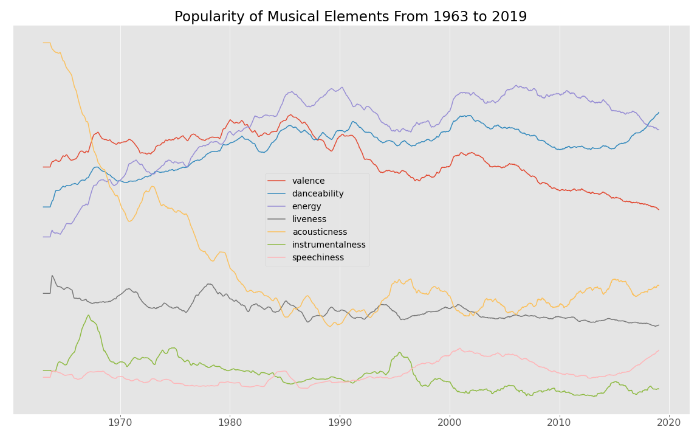
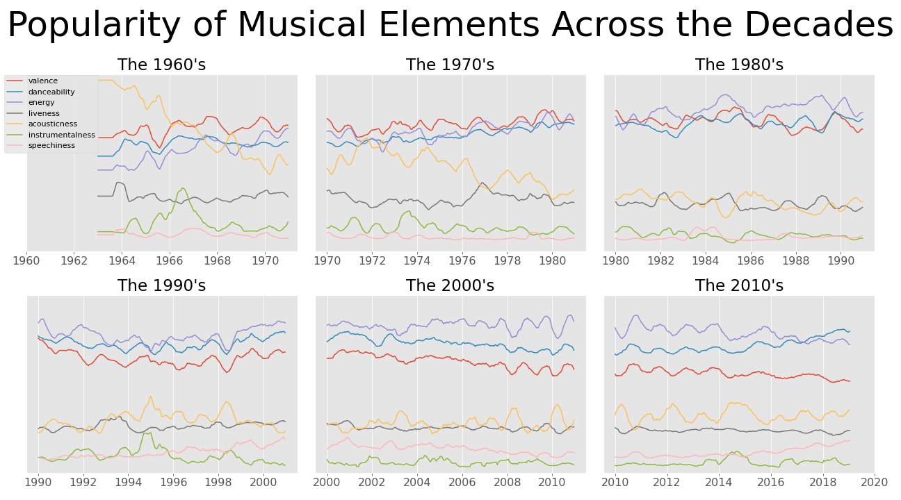

# Tin Pan Data Analysis

Owner: Zack Magnotti
Email: zack@magnotti.net

This is an exploratory data analysis project aimed at a data set containing information on all of the billboard top 200 albums, and the songs in those albums, from 1/5/1963 to 1/19/2019.

The data for this project is too big to upload to github but can be found at https://components.one/datasets/billboard-200.

The documentation for Spotify EchoNest data can be found in the docs folder, or at https://developer.spotify.com/documentation/web-api/reference/tracks/get-audio-features/.

# Figures





# Hypothesis Testing

## Increase in "Speechiness" after the Rise of Rap and Hip-Hop

Hypothesis: The the average "speechiness" of music trends upward over time after 1985, as rap music was invented and popularized

$$
\frac{\partial (speechiness)}{\partial t} \sim N(\mu_{\partial s}, \sigma)
$$

.

$$
H_0: \ \mu_{\partial s} \leq 0
$$

.

$$
H_A: \ \mu_{\partial s} > 0
$$

.

$$
\alpha = .05
$$

### Results

```
Successfully rejected null hypothesis 
 p = 0.014
 T = 2.5
```
